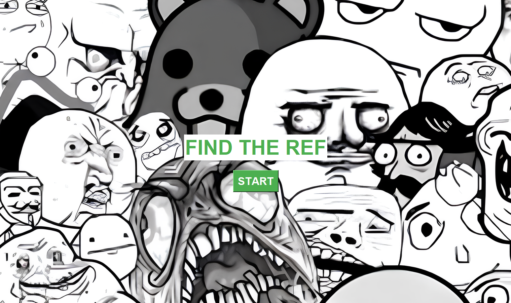
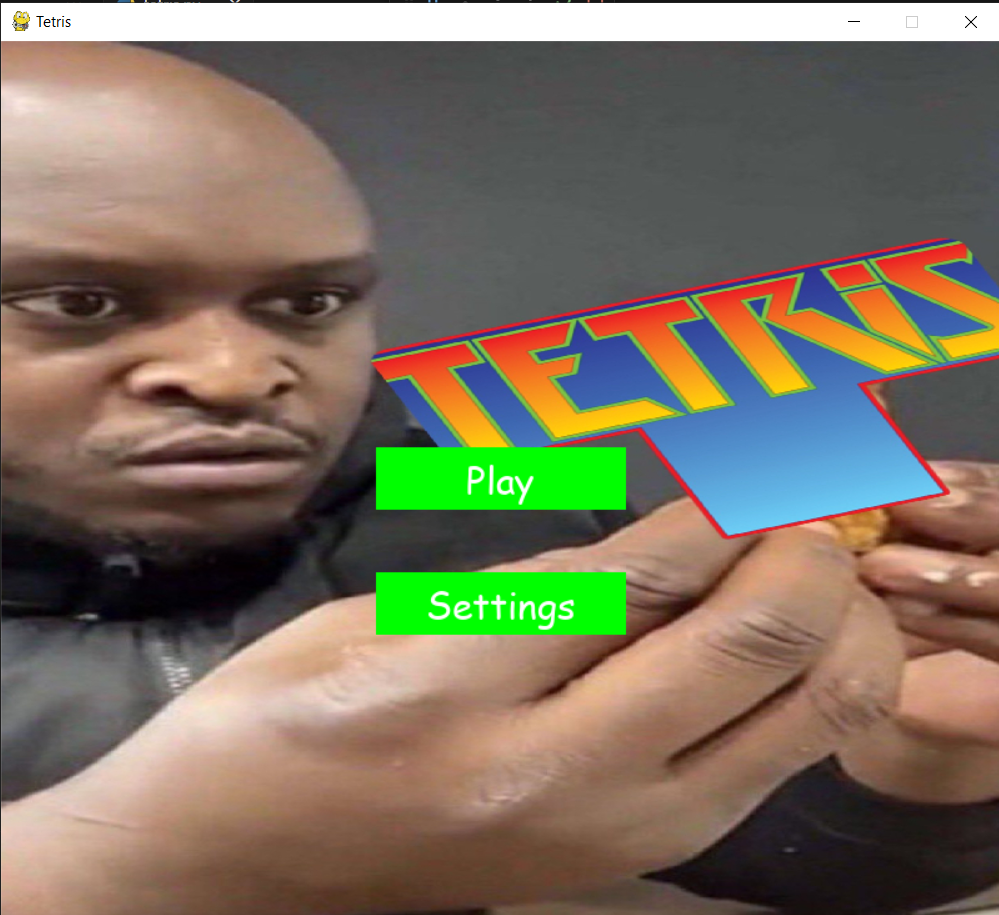
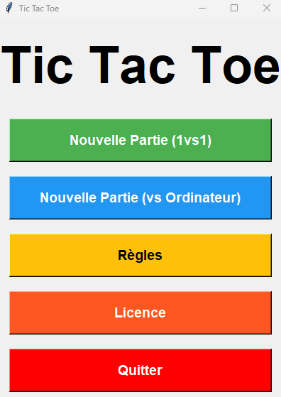

# Projet - Python Games 

Ce dépôt contient trois jeux Python interactifs développés avec Tkinter et Pygame, chacun offrant une expérience unique de jeu.

1. **Soundbox Quiz - FIND THE REF**
   - Un jeu de quiz interactif où les joueurs doivent associer des sons à leurs références visuelles correspondantes.
   
   

2. **Tetris**
   - Une implémentation du célèbre jeu Tetris en Python à l'aide de la bibliothèque Pygame.
   
   

3. **Tic Tac Toe**
   - Le jeu classique du morpion (Tic Tac Toe) où deux joueurs s'affrontent pour aligner trois symboles identiques sur une grille.
   
   

## Installation et Exécution

Clonez le dépôt :

```bash
git clone https://github.com/amarhami/python.git
```

Pour exécuter chaque jeu, suivez les instructions spécifiques dans leurs répertoires respectifs. 

## Développeurs 

- **HAMI Amar**
- **FRAPPART Yanis**

 